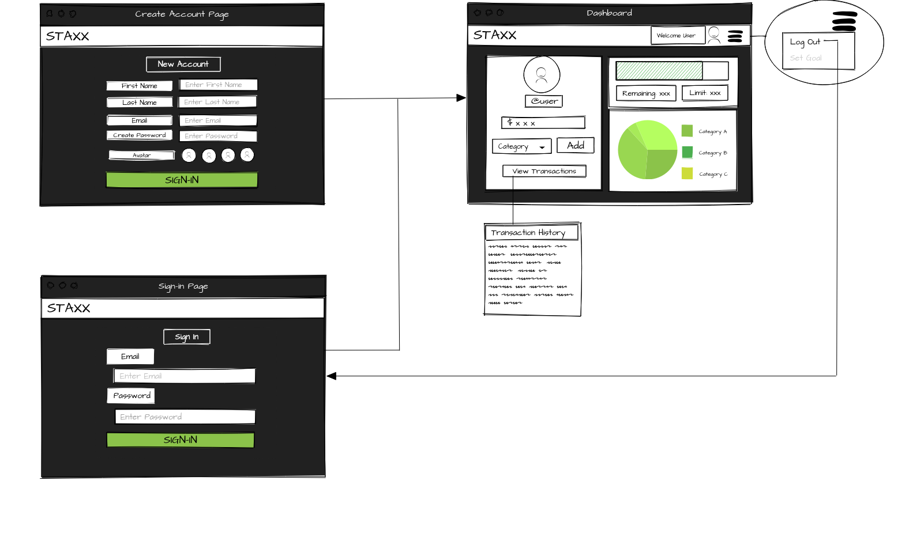
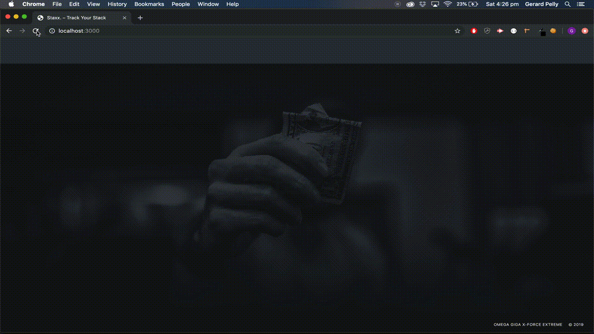

# Staxx

## Overview

* Staxx is a web application that allows its users to categorically track their expenses over a chosen peroid of time.

* After the user has created an account they are then presented with a pop-up modal that allows them to select the chosen time period of either a week or a month and enter the amount of money they would like to allot for that chosen time period.

* Through the dashboard interface the user can then easily enter their transactions as they go, view all their transactions, and view a summary of their transactions as a graph.

## Wireframe

## Presentation

https://drive.google.com/open?id=1nkaZTfT4y1WUrFDRqiCfkUDECL88VbxHIOImWFNeXM4

## Technologies Used

* Javascript
* CSS3
* Handlebars
* NodeJS
* MySQL / Sequelize
* PassportJS (OAuth)
* Chai
* Mocha

## Demo

## Live Website

[Staxx on Heroku](https://shrouded-brook-64155.herokuapp.com)

## Team Members

1. Priyam
2. Sam
3. Gerard

